[](https://github.com/rafaelsoteldosilva/serenity-gb/blob/main/README.md)

# **Serenity-gb**

<p align="center">
  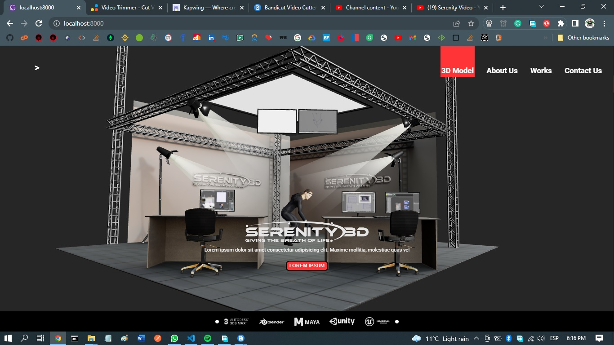
</p>

---

Esta App fué desarrollada para Serenity 3D

No está terminada todavía, pero es totalmente funcional, y la razón de ellos es que la compañía tuvo que postponer el projecto Serenity indefinidamente.

## **Guía de Instalación**

-  Haga GIT Clone de este repo en su disco duro
-  Entre en el directorio creado con el comando cd
-  Ejecute **`npm install`** para instalar todas las dependencias
-  Ejecute **`npm start`** para ejecutar la app

## **Propósito**

-  Mostrar el modelo 3D entregado por el departamento de modelos 3D
-  Crear una bella interfaz con gavetas laterales
-  Crear un diseño responsivo para dispositivos móviles y tablets
-  Mostrar una rejilla de videos extraidos de Vimeo
-  Incluir una forma de contacto
-  Usar el frmework Gatsby para poder hacer SEO

La idea del proyecto es mostrar a los clientes cómo podemos incluir modelos 3D en sus websites. Mostrar también a los clientes potenciales como podemos usar nuestros trajes de captura movimiento para crear sus propios modelos 3D.

Este documento explica las partes constitutivas de este proyecto, en el mismo orden en el que se muestran en el proyecto

## **El proyecto**

Las principales tecnologías que se usan en este proyecto son:

-  Gatsby,
-  React,
-  React-Three-Fiber,
-  Gatsby Global Context,
-  Styled Components,
-  y consumo de una Api con fetch.

El modelo 3D fué hecho con la aplicación Blender, la cual exporta un archivo .glb que fué convertido a un componente de React Three Fiber usando el paquete gltfjsx

Toda la data sobre videos es extraida de la API de Vimeo en build time, usando gatsby-node.js, estos objetos de video son colocados como nodos que luego serán leidos con una consulta de graphql cuando la página `works` sea invocada

La estructura del proyecto es:

<p align="center">
  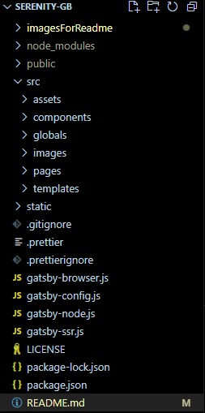
</p>

### **El directorio src**

El directorio src es el directorio principal, ya que contiene todos los archivos funcionales que representan toda la funcionalidad de la app.

Sus subdirectorios son:

-  **components**
-  **globals**
-  **images**
-  **pages**

## **El directorio components**

Contiene todos los componentes que usan las páginas

<p align="center">
  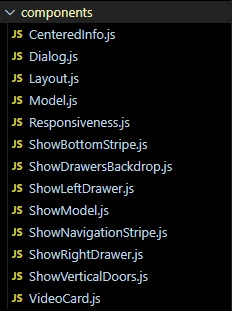
</p>

### - **<ins>src/components/CenteredInfo.js</ins>**

Este componente muestra la información que se muestra encima del modelo 3D, contiene el logo de Serenity, un texto de relleno y un botón

Este es un componente muy sencillo

```jsx
// src/components/CenteredInfo.js
<CenteredInfo firstTimeInApp={globalState.firstTimeInApp}>
   <Logo src={"/serenity-3d-white.png"} alt="logo" />
   <CenteredText>
      Lorem ipsum dolor sit amet consectetur adipisicing elit. Maxime mollitia,
      molestiae quas vel
   </CenteredText>
   <MyButton disabled={false}>LOREM IPSUM</MyButton>
</CenteredInfo>
```

### - **<ins>src/components/Dialog.js</ins>**

Este es un componente usado como contenedor para los diálogos de la app

```jsx
// src/components/Dialog.js
const Dialog = ({
   show,
   setShow,
   children,
   dialogButtons,
   responseYes,
   responseNo,
}) => {
   return (
      <TheDialog>
         <DialogContent show={show}>
            {children}
            {dialogButtons === OkButton && (
               <DialogFooter>
                  <CloseButton onClick={() => setShow(false)}>
                     CLOSE
                  </CloseButton>
               </DialogFooter>
            )}
            {dialogButtons === YesNoButtons && (
               <DialogFooter>
                  <CloseButton onClick={responseYes}>YES</CloseButton>
                  <CloseButton onClick={responseNo}>NO</CloseButton>
               </DialogFooter>
            )}
         </DialogContent>
      </TheDialog>
   );
};
```

Este componente exporta los styled components de `DialogHeader` y `DialogBody`, los cuales son los `children` que espera (sólo se permite texto, por simplicidad)

```jsx
// src/components/Dialog.js
const dialogParts = css`
   color: white;
`;

export const DialogHeader = styled.div`
   ${dialogParts}
   padding: 1em;
   font-weight: bold;
`;

export const DialogBody = styled.div`
   ${dialogParts}
   padding: 1em;
`;
```

Un `DialogFooter` puede tener un botón OK, o los botones YES y NO. Recibe las props necesarias desde el componente padre, tales como: show, setShow, YesNoBuittons, etc..

### - **<ins>src/components/Layout.js</ins>**

Este componente es invocado desde `wrapRootElement`, que se encuentra en el archivo `gatsby-browser.js`.

El propósito de este archivo `Layout.js` es mostrar la apariencia general de la interfaz de la app, la cual consiste de la cinta de navegación (`ShowNavigationStripe.js`), la página y la cinta de fondo de página (`ShowBottomStripe.js`)

```jsx
// src/components/Layout.js
const Layout = ({ children }) => {
   return (
      <React.Fragment>
         <ShowNavigationStripe />
         {children}
         <ShowBottomStripe />
      </React.Fragment>
   );
};
```

El enfoque de composición de componentes es el que usa con `Layout.js` (`<Layout>{element}</Layout>`), dentro de `gatsby-browser.js`

### - **<ins>src/components/Model.js</ins>**

Este es un componente generado con el uso de `npx gltfjsx studio_w_c.glb`

Despés de generarlo, debemos modificarlo con algunos imports, y un useEffect que invoca la `Kill_action` contenida en el model 3D, junto con la inicialización de la cámara

```jsx
// src/components/Model.js
import { useEffect } from "react";
import { useThree } from "@react-three/fiber";
import { initialXPos, initialYPos, initialFov } from "../globalConstants";
...
export default function Model() {
    const group = useRef();
    const { nodes, materials, animations } = useGLTF("./studio_w_c.glb");
    const { actions } = useAnimations(animations, group);

    useEffect(() => {
        actions.Kill_action.play();
    });
    useThree(({ camera }) => {
        camera.position.set(initialXPos, initialYPos, 6.7);
        camera.rotation.set(0.1, -0.8, 0.08);
        camera.fov = initialFov;
        camera.updateProjectionMatrix();
    });
    ...
```

El abre el modelo con **`useGLTF("./studio_w_c.glb");`**, y destructura el resultado, obteniendo tres objetos que necesita: `nodes, materials, animations`. La función useGLTF espera que un archivo .glb (el cual es una versión del modelo 3D) esté en el directorio `public`. La forma de hacer que con el `npm install` se copie el .glb allí es colocando una copia en el directorio **`static`**, que se encuentra en el directorio raiz.

La función useGLTP es parte del paquete React-Three-Fiber

`actions.Kill_action.play();` hace que el modelo se anime, este componente debe encontrar la acción `Kill_action`, que fué puesta allí con `Blender`.

Este componente **`Model`** tambier establece la posición de la cámara (`... camera.position ...`), de forma que el modelo esté mayormente centrado en la pantalla.

Este componente es invocado por otro componente llamado `ShowModel.js` el cual es a su vez invocado por las páginas `Home.js` e `index.js`, las cuales son básicamente lo mismo excepto que `Home.js` no muestra las puertas verticales, sólo `CendteredInfo.js`, e `Index.js` sí lo hace (es como la página por defecto de la app cuando es ejecutada)

### - **<ins>src/components/Responsiveness.js</ins>**

Es sólo un componente utilitario para propósitos de responsividad. Muestra el tamaño de la pantalla actual, basándose en el tema global, definido para los styled components:

```jsx
// src/globals/globalStyles.js
currentDevice: {
  mobileS: "(min-width: 320px)",
  mobileM: "(min-width: 375px)",
  mobileL: "(min-width: 425px)",
  tablet: "(min-width: 768px)",
...
},
```

Se muestra en la parte superior de la pantalla.

Se usa sólo en la etapa de desarrollo.

### - **<ins>src/components/ShowBottomStripe.js</ins>**

Como sugiere su nombre, el propósito de este componente es mostrar la cinta de fondo de página que se ve en la app, la cual contiene los logos de las compañías cuyos productos usa Serentity 3D

<p align="center">
  
</p>

Es invocado desde el component `Layout.js`

### - **<ins>src/components/ShowDrawersBackdrop.js</ins>**

Muestra una cortina que cubre la app
It shows a backdrop that covers the app when some of the lateral drawers are shown.

```jsx
// src/components/ShowDrawersBackdrop.js
const Backdrop = styled.div`
   position: fixed;
   width: 100%;
   height: 100%;
   background-color: rgba(0, 0, 0, 0.5); // It's a 50% opacity black backdrop
   z-index: 100;
   top: 0;
   right: 0;
`;

const ShowDrawersBackDrop = (props) => {
   return <Backdrop onClick={props.closeDrawer}></Backdrop>;
};
```

<p align="center">
  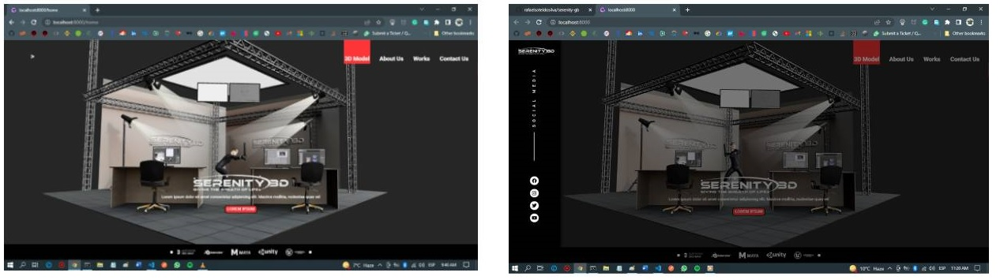
</p>

### - **<ins>src/components/ShowLeftDrawer.js</ins>**

Abre la gaveta izquierda, la cual sirve para que el/la usuario comparta con social media

<p align="center">
  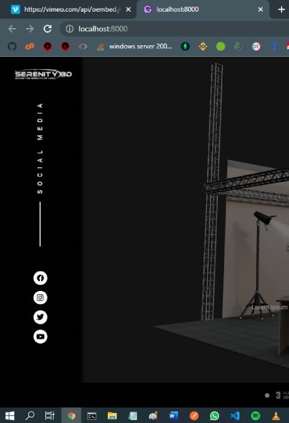
</p>

Yo usé css transformation y transition para mostrar el efecto de una gaveta que se abre

```jsx
const LeftDrawer = styled.div`
   position: fixed;
   height: 100%;
   background: black;
   top: 0;
   right: 100%;
   width: ${({ drawersWidth }) => drawersWidth};
   z-index: 200;
   box-shadow: ${({ show }) => (show ? "3px" : "0px")} 0px ${({ show }) =>
         show ? "7px" : null} ${({ theme }) => theme.colors.blackColor};
   transform: translateX(0%);
   transition: transform 0.3s ease-out;
   transform: ${({ show }) => (show ? "translateX(100%)" : null)};
`;
```

Si `show` es `true`, la transformación es `translateX(100%)`, 100% se refiere al ancho de la gaveta.

### - **<ins>src/components/ShowModel.js</ins>**

Es usado básicamente para mostrar el modelo 3D. en la app

Estas son otras funciones de este componente:

-  Mueve el escenario tras el movimiento del mouse, pero, si el dispositivo no usa mouse, muestra 4 botones, arriba, abajo, izquierda y derecha, que se usan para mover el modelo.

-  Setea la intensidad de la luz usada para mostrar el modelo 3D, junto con la dirección de la luz. Sin esto, el modelo no se podría ver.

```jsx
// src/components/ShowModel.js
return (
   <ModelContainer>
      <LeftTransparentButton
         firstTimeInApp={globalState.firstTimeInApp}
         onClick={handleLeftButtonClick}
      >
         <FontAwesomeIcon icon={faCircleArrowLeft} />
      </LeftTransparentButton>
      ...
      {typeof window !== "undefined" && (
         <Canvas>
            <ambientLight intensity={0.4} />
            <directionalLight
               intensity={2}
               color="white"
               position={[0, 2, 4]}
            />
            <Suspense fallback={null}>
               <Model />
            </Suspense>
            {canMoveModel && <MoveModel />}
         </Canvas>
      )}
   </ModelContainer>
);
```

El código `typeof window !== "undefined" &&` que se encuentra sobre la definición del canvas es la solución que encontré cuando intentaba montar el proyecto en un cloud hosting (intenté con Netlify y Heroku). Sucede que bajo Gatsby, el objeto `window` tiene un valor inicial sólo para desarrollo, pero cuando se construye el bundle de producción tiene un valor de `undefined`, el cual produce un error. El error no era fácil de solucionar, ya que el mensaje no era suficientemente claro, así que después de investigar, esta es la solución que encontré que permitía que la construcción del bundle de producción fuese exitosa.

Otro truco que vale la pena mencionar, es el uso del evento vinculado al cambio de tamaño de la ventana:

```jsx
// src/components/ShowModel.js
useEffect(() => {
   const updateSize = () => {
      windowWidth = window.innerWidth;
      windowHeight = window.innerHeight;
   };
   window.addEventListener("resize", updateSize);
   updateSize();
   return () => window.removeEventListener("resize", updateSize); // detach the event listener when finished
}, []);
```

Con el uso de este evento vinculado al cambio de tamaño de la ventana, me deshice de la "vibración" que se producía al cambiar el tamaño de la ventana.

### - **<ins>src/components/ShowNavigationStripe.js</ins>**

```jsx
// src/components/ShowNavigationStripe.js
return (
   <React.Fragment>
      <ShowLeftDrawer show={leftDrawerOpen} setShow={setLeftDrawerOpen} />
      {leftDrawerOpen && (
         <ShowDrawersBackdrop closeDrawer={handleBackdropClickLeft} />
      )}
      <ShowRightDrawer show={rightDrawerOpen} setShow={setRightDrawerOpen} />
      ...
      <NavigationStripe firstTimeInApp={globalState.firstTimeInApp}>
         ...
         <NavigationItemsContainer>
            {globalState.menuItemsList.map((menuItem, index) => {
               return (
                  <NavBarItem
                     active={globalState.currentComponent === menuItem.itemPath}
                     to={menuItem.itemPath}
                     key={index}
                  >
                     {menuItem.title}
                  </NavBarItem>
               );
            })}
         </NavigationItemsContainer>
         <RightOpenDrawerButton onClick={handleRightOpenDrawerButtonOnClick}>
            <FontAwesomeIcon icon={faBars} />
         </RightOpenDrawerButton>
      </NavigationStripe>
   </React.Fragment>
);
```

Muestra o cierra la gaveta izquierda, junto con le backdrop. También muestra la gaveta derecha, la cual está condicionada al tamaño de la pantalla.

```jsx
// src/components/ShowNavigationStripe.js
const RightOpenDrawerButton = styled.button`
   ${generalNavBarItem}
   position: absolute;
   padding-bottom: 0;
   margin-right: 1.5em;
   @media ${({ theme }) => theme.currentDevice.laptop} {
      display: none;
   }
`;
```

La instrucción `@media` indica que a partir del tamaño laptop, el botón se esconde, y no puede ser usado.

Los menu items son creados en el globalState (que está en `src/globals/globalContextProvider.js`). La razón de tener los menu items cargados en una variable global, es que también serán mostrados en la gaveta derecha (ver `src/components/ShowRightDrawer.js`) cuando se abre, y por supuesto, los menu items serán escondidos, todo esto sucede cuando el tamaño de la pantalla es menor o igual al tamaño laptop:

```jsx
// src/components/ShowNavigationStripe.js
const NavBarItem = styled(Link)`
   ${generalNavBarItem};
   display: none; // hide the menu items, mobile first principle

   @media ${({ theme }) => theme.currentDevice.laptop} {
      display: inline;
      font-size: 1.5em;
      padding-left: 0.1em;
      padding-right: 0.1em;
      margin-right: 1.5em;
   }
`;
```

La app fue desarrollada con el principio de `mobile first` en mente, por eso es que normalmente, los menu items están escondidos, suponiendo que es un dispositivo pequeño, y a partir del tamaño laptop, los menu items se muestran.

### - **<ins>src/components/ShowRightDrawer.js</ins>**

<p align="center">
  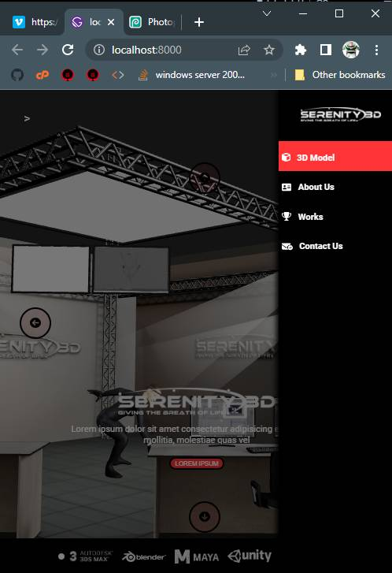
</p>

Sólo recorre el `globalState.menuItemsList` y los muestra verticalmente

En este componente usé un truco similar al de `ShowLeftDrawer.js`

```jsx
// src/components/ShowRightDrawer.js
{
   globalState.menuItemsList.map((menuItem, index) => {
      return (
         <NavigationDrawerItem
            active={globalState.currentComponent === menuItem.itemPath}
            to={menuItem.itemPath}
            key={index}
            onClick={() => setShow(false)}
         >
            {menuItem.icon}
            &nbsp;&nbsp;&nbsp;
            {menuItem.title}
         </NavigationDrawerItem>
      );
   });
}
```

### - **<ins>src/components/ShowVerticalDoors.js</ins>**

<p align="center">
  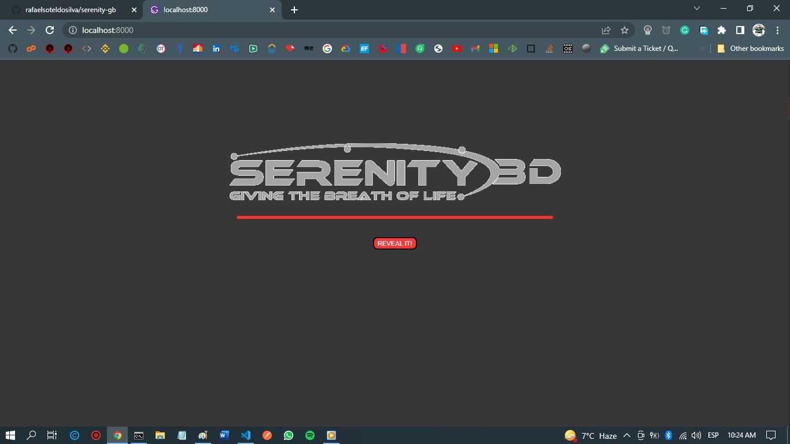
</p>

<p align="center">
  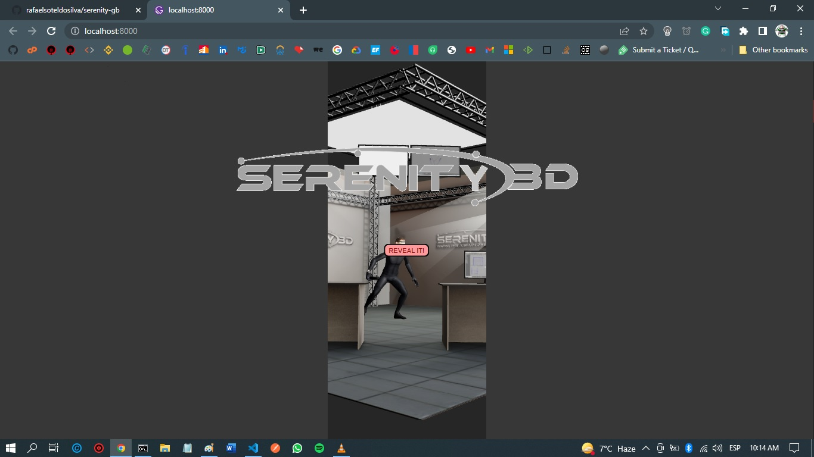
</p>

Este componente esconde el modelo 3D detrás de dos puertas grises inicialmente cerradas, las cuales se abren como 2 puertas verticales deslizantes cuando el/la usuario presiona el botón `Reveal`

```jsx
// src/components/ShowVerticalDoors.js
<DoorsContainer firstTimeInApp={globalState.firstTimeInApp}>
   <LinearProgressBarContainer disappear={disappear}>
      <ShowLinearProgressBar progress={progressValue} />
   </LinearProgressBarContainer>
   <SerenityGiff src={"/Serenity.gif"} alt="Serenity Giff" />
   {progressValue === 100 && (
      <RevealButton onClick={handleShowClick} disabled={false}>
         REVEAL IT!
      </RevealButton>
   )}
   <LeftVerticalDoor
      okToSlideDoors={okToSlideDoors}
      src={gray}
      alt="left door"
   />
   <RightVerticalDoor
      okToSlideDoors={okToSlideDoors}
      src={gray}
      alt="right door"
   />
</DoorsContainer>
```

El procedimiento `handleShowClick` setea `okToSildeDoors` en `true`:

```jsx
function handleShowClick() {
   setTimeout(function () {
      globalDispatch({ type: globalConstants.notFirstTimeInApp });
   }, 3000);
   setOkToSlideDoors(true);
   setDisappear(true);
}
```

(La app espera 3000 milisegundos, tiempo suficiente para que las puertas estén abiertas. Note que `animation-duration` es también de 3s)

Todo el truco de mostrar puertas verticales fue hecho con el uso de css animation, definí un styled component que cuando la variable `okToSlideDoors` es true, hace que la animación se active.

```jsx
// src/components/ShowVerticalDoors.js, Left door:
const LeftVerticalDoor = styled.img`
   ${BothVerticalDoors}

   ${({ okToSlideDoors }) =>
      okToSlideDoors &&
      `
        clip-path: polygon(0 0, 50% 0, 50% 100%, 0 100%);
        animation-duration: 3s;
        animation-name: left-door;
        animation-fill-mode: forwards;

        @keyframes left-door {
            from {
                width: 100vw;
                height: 100vh;
            }
            to {
                width: 0px;
                height: 100vh;
            }
        }
    `}
`;
```

### - **<ins>src/components/VideoCard.js</ins>**

<p align="center">
  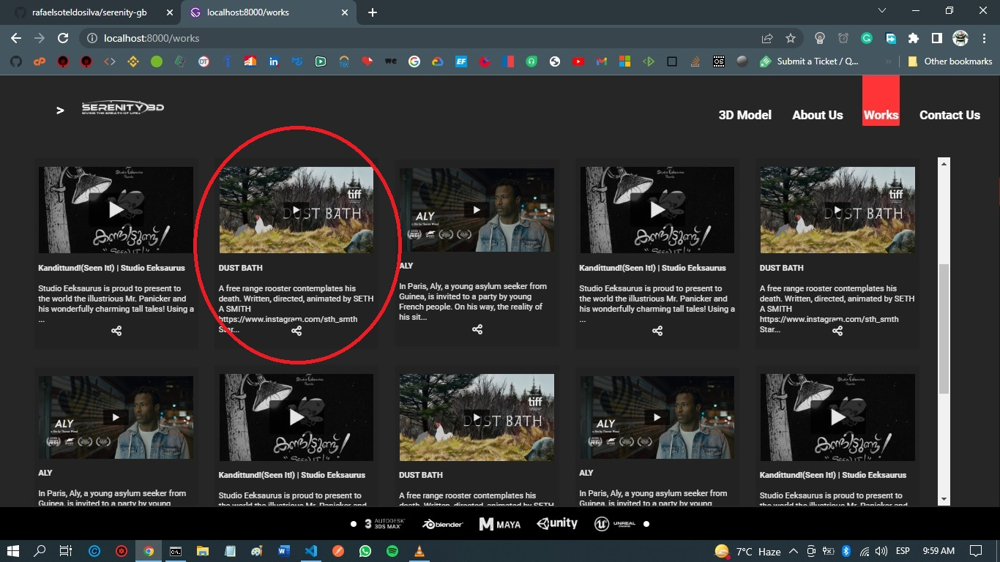
</p>

<p align="center">
  Este es un ejemplo de una videocard
</p>

Este es el componente en cargo de mostrar cada video card, las cuales son los videos que se muestran en la rejilla de videos.

Este componente es muy sencillo:

```jsx
// src/components/VideoCard.js
return (
   <Card index={index}>
      <CardContent onClick={(e) => handleClickOnVideoCard(videoObject, e)}>
         <CardImage
            src={
               videoObject.thumbnail_url_with_play_button !== null
                  ? videoObject.thumbnail_url_with_play_button
                  : noThumbnailAvailable
            }
            alt="Vimeo Thumbnail"
         />
         <CardNoImageContent>
            <CardTitle>
               {videoObject.title !== null
                  ? shortenTitle(videoObject.title)
                  : `No title - Video id: ${videoObject.video_id}`}
            </CardTitle>
            <CardDescription>
               {videoObject.description !== null
                  ? shortenDescription(videoObject.description)
                  : globalConstants.noDescriptionAvailable}
            </CardDescription>
         </CardNoImageContent>
      </CardContent>
      <CardActionButtons>
         <ButtonIcon>
            <ShowIcon
               icon={faShareNodes}
               onClick={(e) => handleClickOnSocialButton(videoObject, e)}
            />
         </ButtonIcon>
      </CardActionButtons>
   </Card>
);
```

la propiedades de VideoObj son enviadas desde la página `works.js` (ver `src/pages/works.js`)

VideoCard también indica a la app de agregar un nuevo menu a la lista global:

<p align="center">
  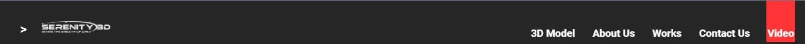
</p>

```jsx
// src/components/VideoCard.js
const handleClickOnVideoCard = (videoObj, e) => {
   if (!isVideoMenuItemPresent()) {
      globalDispatch({
         type: globalConstants.addVideoMenuItem,
         newMenuItem: {
            itemPath: globalConstants.videoPath,
            title: globalConstants.videoMenuItemTitle,
            icon: <FontAwesomeIcon icon={faVideo} />,
         },
      });
   }
   // La info de video es enviada al globalState
   globalDispatch({
      type: globalConstants.keepVideoData,
      videoDataObject: videoObj,
   });
   navigate(globalConstants.videoPath);
};
```

## **Globals**

Contiene tres componentes que cierta data esté disponible para todos los componentes

Estos son:

-  src/globals/globalConstants.js,
-  src/globals/globalContextProvider.js and
-  src/globals/globalState.js

### - **<ins>src/globals/globalConstants.js</ins>**

Como su nombre indica, contiene constantes globales tales como los `paths` usados por los menús, los títulos usados por los menús, etc.

```jsx
// src/globals/globalConstants.js
export const threeDModelPath = "/home";
export const aboutUsPath = "/about";
export const worksPath = "/works";
...
```

### - **<ins>src/globals/globalContextProvider.js</ins>**

Define el contexto global, el cual es usado para compartir data con todos los componentes. Contiene cosas como, la página corrientemente activa, los videos para la página `Works`, los items de menú, entre otros.

La razón de tener los objetos de información de video que se lee de la api, guardados aquí para la página `Works`, y no en `Redux`, es que yo se que siempre serán un puñado de videos, y un contexto es suficiente

El componente define el contexto y usa el hook `useReducer` para realizar las acciones del contexto, tales como:

-  SET_CURRENT_COMPONENT (guardar nombre del componente actual)
-  NOT_FIRST_TIME_IN_APP (indicar que ya no es la primera vez)
-  VIDEO_DATA_ALREADY_LOADED (indicar que la data de videos ya está cargada), etc..

Se usa un useEffect [] para crear todos los menú items que serán usados por `ShowNavigationStripe.js` y `ShowRightDrawer.js`

```jsx
const initialStateContext = {
...
   allVideosDataObjects: [],
...

export const GlobalStateContext = React.createContext(initialStateContext);

const reducer = (state = initialStateContext, action) => {
   switch (action.type) {
      case globalConstants.notFirstTimeInApp:
         return { ...state, firstTimeInApp: false };

      case globalConstants.setCurrentComponent:
         return { ...state, currentComponent: action.currentComponent };

...
   }
};

const GlobalContextProvider = ({ children }) => {
   const [globalState, globalDispatch] = React.useReducer(
      reducer,
      initialStateContext
   );

   useEffect(() => {
      if (globalState.menuItemsList.length === 0) {
         globalDispatch({
            type: globalConstants.addVideoMenuItem,
            newMenuItem: {
               itemPath: globalConstants.threeDModelPath,
               title: globalConstants.threeDModelMenuItemTitle,
               icon: <FontAwesomeIcon icon={faCube} />,
            },
         });

...
      }
      // eslint-disable-next-line react-hooks/exhaustive-deps
   }, []);

   return (
      <GlobalStateContext.Provider value={{ globalState, globalDispatch }}>
         {children}
      </GlobalStateContext.Provider>
   );
};
```

### - **<ins>src/globals/globalStyles.js</ins>**

Define el tema global usado en los styled components, el cual define los colores usados por la interfaz, el tamaño de los dispositivos (este último mes usado para fines de responsividad)

También define el estilo global para toda la interfaz, las características de los botones usados, tales como su apariencia cuando están deshabilitados, el colo, comportamiento de hover, la apariencia cuando están activos, etc..

<p align="center">
  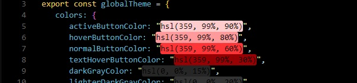
</p>
<p align="center">
  This is how I see it in VS Code
</p>

```jsx
import styled, { createGlobalStyle } from "styled-components";

export const globalTheme = {
   // define the global colors
   colors: {
      activeButtonColor: "hsl(359, 99%, 90%)",
      hoverButtonColor: "hsl(359, 99%, 80%)",
      normalButtonColor: "hsl(359, 99%, 60%)",
...
   },
   // define the sizes of the devices
   currentDevice: {
      mobileS: "(min-width: 320px)",
      mobileM: "(min-width: 375px)",
...
   },
};

// este es el estilo global usado en toda la interfaz
export const GlobalStyles = createGlobalStyle`
    html, body {
        margin: 0;
        padding: 0;
    }
    *, *::after, *::before {
        box-sizing: border-box;
    }
    body {
        display: flex;
        background: ${({ theme }) => theme.colors.darkGrayColor};
...

`;
// This is the global style used in for buttons, it includes the background color, the hover behavior, etc.
export const Button = styled.button`
   height: 2em;
   ${({ disabled }) =>
      disabled &&
      `
            disabled
        `}
   background-color: ${({ theme, disabled }) =>
      disabled ? theme.colors.mediumGrayColor : theme.colors.normalButtonColor};
   color: ${({ theme }) => theme.colors.whiteColor};
   border-radius: 8px;
   &:hover {
      background-color: ${({ theme, disabled }) =>
         disabled ? null : theme.colors.hoverButtonColor};
      color: ${({ theme, disabled }) =>
         disabled ? null : theme.colors.textHoverButtonColor};
   }
...
`;
// define the styled component used to display the large background text in About.js and Contact.js
export const BackgroundText = styled.p`
   position: fixed;
   font-size: 6rem;
...
`;
```

El styled component `BackgroundText` es usado por las páginas `Contact.js` y `About.js` para mostrar un gran texto en background.

## **Pages**

### - **<ins>src/pages/404.js</ins>**

Se muestra cuando la página no existe.

### - **<ins>src/pages/aboutUs.js</ins>**

Está a cargo de mostrar la página `AboutUs.js`, cuando el usuario presiona en el menú item **About Us**

Usa una consulta `graphql` para obtener la imagen usada, la cual está en el directorio `src/images`

(Las diferentes opciones de un gatsby-plugin-image se encuentran aquí: https://www.gatsbyjs.com/docs/reference/built-in-components/gatsby-plugin-image/)

Esta consulta de `graphql` extrae la imagen con la ayuda del plugin `gatsby-source-filesystem`, y también muestra una imagen difusa cuando está cargándola

```jsx
// src/pages/aboutUs.js
// GatsbyImage and getImage are imported from "gatsby-plugin-image"
import { StaticImage, GatsbyImage, getImage } from "gatsby-plugin-image";
...
// The ShowImage styled component is based on gatsbyImage
const ShowImage = styled(GatsbyImage)`...`
...
// data is the result of the graph query
const About = ({ data }) => {
...
// The image is extracted from the data {getImage(data.file)}
<ShowImage image={getImage(data.file)} alt="Example Gatsby Image" />
...

export const imageQuery = graphql`
   query {
      file(relativePath: { eq: "viking.jpg" }) {
         childImageSharp {
            gatsbyImageData(
               quality: 100
               layout: CONSTRAINED
               placeholder: BLURRED
            )
         }
      }
   }
`;
```

### - **<ins>src/pages/contact.js</ins>**

<p align="center">
  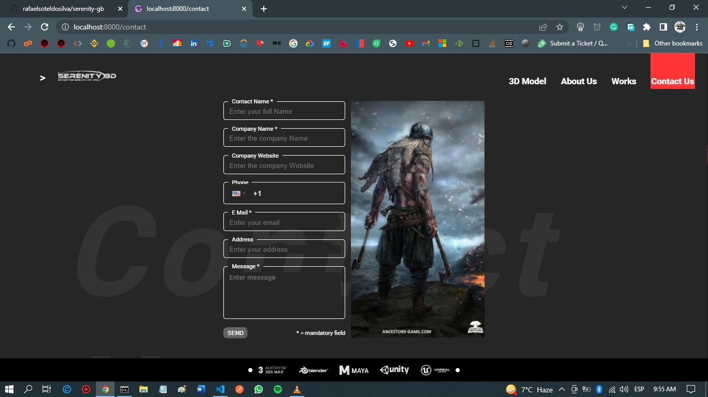
</p>

<p align="center">
  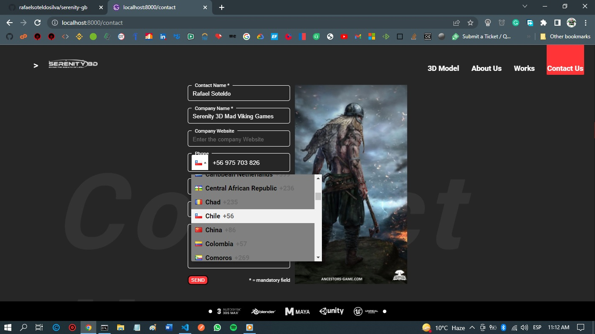
</p>

Muestra la forma contacto, la cual es una forma controlada

Habilita el botón `SEND` cuando no hay errores en los campos.

Usa expresiones regulares para la validación.

Todos los text boxes son como este: 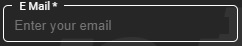, para los cuales usé el html fieldset para componer los styled components de tal fildset (`const InputField = styled.fieldset...`), entonces sobreescribí sus componentes internos y comportamiento, por ejemplo, borde, comportamiento hover, legenda, input, textarea, etc., apariencia cuando hay un error 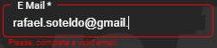, etc..

En el caso del campo teléfono, uso el paquete `react-phone-input-2` (https://www.npmjs.com/package/react-phone-input-2), el cual muestra los códigos de área en forma simpática

```jsx
// src/pages/contact.js
...
// Each inputField will be based on fieldset, but I'll overwrite some of its components:
const InputField = styled.fieldset`
   border: 1px solid ${({ error }) => (error ? "red" : "white")};
   ...

   &:hover {
      border-color: ${({ theme, error }) =>
   ...
   }

   legend {
      padding: 0 7px;
      color: white;
   }

   Input {
      background-color: hsl(0, 0%, 15%);
      color: white;
   ...
   }

   TextArea {
      background-color: hsl(0, 0%, 15%);
   ...
}
`;

...

const Contact = ({ data }) => {
...
// I use regExp to perform validations
   function checkFieldWithRegex(field) {
      const fullNameRE = /^[\p{L}'][ \p{L}'-]*[\p{L}]$/u;
...
     switch (field) {
         case contactName:
            result = new RegExp(fullNameRE).test(formValues[field]);
            break;
...

// Overwrite the styles for the phone
function phoneStyles(what) {
   let styleObject = null;
   switch (what) {
      case "phoneContainerStyle":
         styleObject = {
            width: "14em",
            ...
         };
         break;
      case "phoneInputStyle":
         styleObject = {
            backgroundColor: globalStyles.globalTheme.colors.darkGrayColor,
            ...
         };
         break;
...
}

...

   return (
      <ContentContainer>
         <globalStyles.BackgroundText>Contact Us</globalStyles.BackgroundText>

         <FormContainer>
            <FieldContainer>
            // The inputField has to declare its components, which will have some appearance and behavior properties overwritten
            // The array touched will indicate which fields has something to validate
            // errorMesages is an array declared with useRef, so its contents are available on change

               <InputField
                  error={
                     touched[contactName] &&
                     errorMessagesRefValues.current.contactName !== ""
                  }
               >
                  <legend>Contact Name *</legend>
                  <Input
                     type="text"
                     name={contactName}
               ...
                  />
               </InputField>
               <FieldErrorText>
                  {touched[contactName] &&
                     errorMessagesRefValues.current.contactName}
               </FieldErrorText>
            </FieldContainer>

...

         </FormContainer>
         // The image comes from a graphql query
         <ShowImage image={getImage(data.file)} alt="Example Gatsby Image" />
      </ContentContainer>
   );
};

...
```

### - **<ins>home.js</ins> and <ins>index.js</ins>**

Estas dos páginas son básicamente las mismas, excepto que `Home.js` no muestra las puertas verticales, e `Index.js` si lo hace.

`Index.js` se ejecuta cuando la aplicación es ejecutada, después, cuando se navega, es `Home.js` la que se muestra.

```jsx
// src/pages/index.js
return (
   <ModelContainer>
      <ShowVerticalDoors />
      <ShowModel />
      <ShowCenteredInfo />
   </ModelContainer>
);
```

```jsx
// src/pages/home.js
return (
   <ModelContainer>
      <ShowModel />
      <ShowCenteredInfo />
   </ModelContainer>
);
```

gatsby elige la página por defecto por el nombre, en este caso `Index.js`, pero después, cuando se hace navegación, es `Home.js` la que se usa:

```jsx
// src/globals/globalContextProvider.js
...
globalDispatch({
   type: globalConstants.addVideoMenuItem,
   newMenuItem: {
      itemPath: globalConstants.threeDModelPath,
      title: globalConstants.threeDModelMenuItemTitle,
      icon: <FontAwesomeIcon icon={faCube} />,
   },
});
...
```

`globalConstants.threeDModelPath === "/home"`, y nó `"/index"`, por eso `Index.js` no será usada otra vez

### - **<ins>src/pages/video.js</ins>**

<p align="center">
  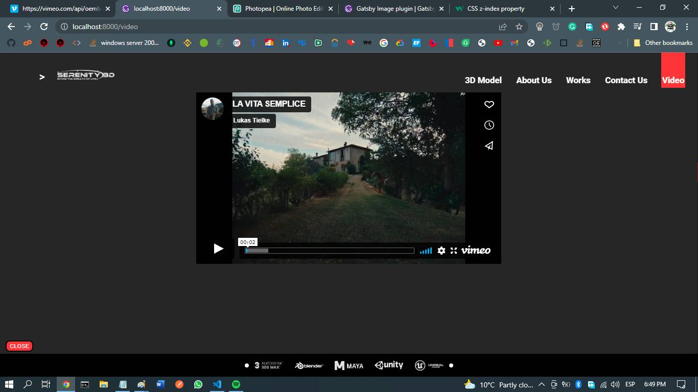
</p>

Muestra el video al que el/la usuario hizo click en la página `Works.js`.

Su implementación es muy simple.

El botón `CLOSE` se deshace del menú item `Video` que se encuentra en la lista global de menús.

```jsx
const handleClickOnClose = (e) => {
   globalDispatch({ type: globalConstants.deleteVideoMenuItem });
   navigate(globalConstants.worksPath);
};
```

### - **<ins>src/pages/works.js</ins>**

<p align="center">
  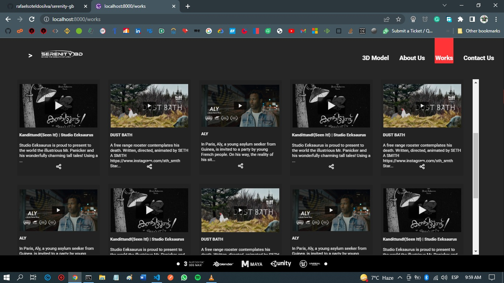
</p>

Muestra una rejilla con videos tomados de la API de Vimeo. usa una consulta `graphql` para obtener la info de los videos, tales como la imagen the thumbnail.

Hace un `.map` por el arreglo de videos, en invoca a `Videocard` con cada uno.

El propósito de esta página es mostrar todos los trabajos que la sub compañía Serenity 3D habría hecho con sus clientes.

```jsx
// src/pages/works.js
const Works = ({ data }) => {
// data is the result of the graph query, gatsby places it in the context of the page
...

   return (
      <React.Fragment>
         <ContentContainer>
         // The main logic is traversing through the data.allWorks.nodes array, and invoking VideoCard on each video
         // object
            {data.allWorks.nodes.map((videoInfo, ndx) => {
               return <VideoCard videoObject={videoInfo} index={ndx} />;
            })}
         </ContentContainer>
      </React.Fragment>
   );
};

...

// This is the graphql query
export const query = graphql`
   query {
      allWorks {
         nodes {
            author_name
            description
            duration
            thumbnail_url_with_play_button
            title
            upload_date(locale: "")
            video_id
         }
      }
   }
`;
```

La consulta `graphql` de esta página obtiene su contenido de nodos creados a través de `gatsby-node.js`, allí es donde la consumpción de la API de Vimeo ocurre.

## **Archivos especiales de gatsby, incluidos en el template Gatsby-Starter**

### - **<ins>gatsby-browser.js and gatsby-ssr.js</ins>**

Estos dos archivos son usados para configurar la app de Gatsby para un browser de internet, como también el servidor (en caso de server side rendering ssr)

Exportan el element `wrapRootElement`, el cual rodea la aplicación con el tema global usado para los styled components, como también ejecuta los globalStyles, y encierra todas las páginas con el `globalContextProvider`.

Cada página es encerrada por el componente `Layout.js`.

```jsx
// gatsby-browser.js and gatsby-ssr.js
<ThemeProvider theme={globalTheme}>
   <GlobalStyles />
   <GlobalContextProvider>
      <Layout>{element}</Layout>
   </GlobalContextProvider>
</ThemeProvider>
```

`gatsby-browser.js` es usado para navegación con un browser normal, mientras que `gatsby-ssr.js` es usado por server-side-rendering.

### - **<ins>gatsby-config.js</ins>**

Aquí es donde configuramos los plugins que usaremos en la aplicación, una vez instalados con `npm install`.
Here we configure the plugins used by the app.

He dejado los plugins que son instalados por defecto al usar el `gatsby-starter` (`npx gatsby init Serenity-gb`)

El plugin que no está en la lista de los por defecto es `gatsby-plugin-google-fonts` el cual incluye `Google Fonts`, en este caso `Roboto` y `Open Sans`

```jsx
// gatsby-config.js
module.exports = {
   siteMetadata: {
   ...
   },
   plugins: [
      ...
      {
         resolve: `gatsby-plugin-google-fonts`,
         options: {
            fonts: [
               `Roboto\:300,400,500,700`,
               `Open Sans\:300,400,400i,700`,
            ],
            display: "swap",
         },
      },
      ...
   ],
};

```

### - **<ins>gatsby-node.js</ins>**

Crea los nodos de data de video, extraidos de la API de Vimeo

Define los videos `videosToShow` por adelantado:

```jsx
const videosToShow = [
   {
      url: "https://vimeo.com/675717426",
   },
   {
      url: "https://vimeo.com/675385832",
   },
   ...
];
```

Una vez definidos, debemos obtener la info de la API (Estoy usando un endpoint especial que tiene la API de Vimeo, llamado oembed, el cual no es protejido, y permite obtener información de videos sin tener que comprar la API)

```jsx
exports.sourceNodes = async ({
   actions,
   createNodeId,
   createContentDigest,
}) => {
   const { createNode } = actions;

   // here, we traverse through the array of videos info, which are the videos we set with videosToShow, but we are interested in the info for each one, like author, description, thumbnail Url With Play Button, title, etc., that's the info this oembed endpoint will deliver (https://developer.vimeo.com/api/oembed/showcases)
   const allWorks = await Promise.all(
      videosToShow.map(async (video) => {
         const videoData = await fetch(
            `https://vimeo.com/api/oembed.json?url=${video.url}`
         );
         return await videoData.json();
      })
   );
   // Actually, create the nodes for each video info
   allWorks.forEach((video, ndx) => {
      createNode({
         ...video,
         id: createNodeId(ndx),
         parent: null,
         children: [],
         internal: {
            type: NODE_TYPE,
            content: JSON.stringify(video),
            contentDigest: createContentDigest(video),
         },
      });
   });
};
```

Este es un ejemplo de la data que es entregada por este oembed endpoint de la API de Vimeo:

https://vimeo.com/api/oembed.json?url=https://vimeo.com/645719996
