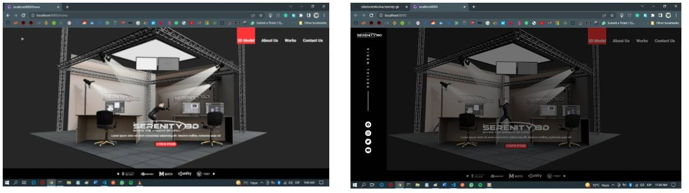
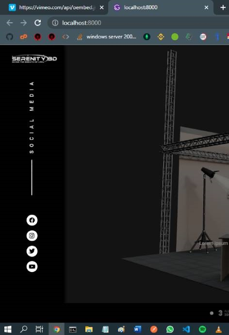
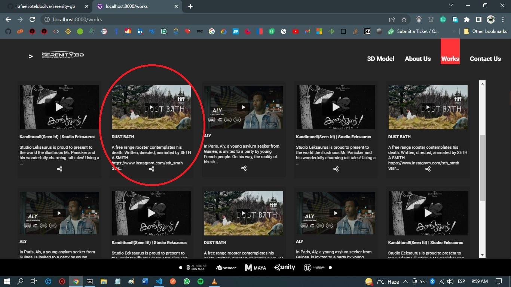
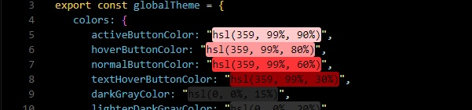
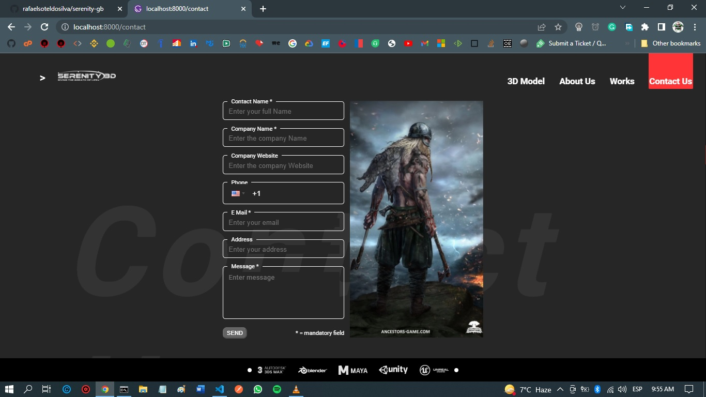
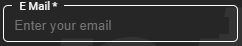

[](https://github.com/rafaelsoteldosilva/serenity-gb/blob/main/README.es-cl.md)

# **Serenity-gb**

<p align="center">
  <a href="https://www.youtube.com/watch?v=5Lft05QGfK8" rel="youtube video">
     
  </a>
</p> 
<p align="center">
  <a href="https://www.youtube.com/watch?v=5Lft05QGfK8" rel="Serenity-Front-YouTube">
     Go to Youtube Video
  </a>
</p>

---

This App was built for Serenity 3D, a company that would be part of the company Mad Viking Games.

It is not finished yet, but it's totally functional, and the reason for it is that the company had to postpone the Serenity Project indefinitely

## **Installation guide**

-  GIT clone the repo in your hard drive
-  cd into the created folder
-  Run **`npm install`** in order to install all dependencies
-  Run **`npm start`** in order to start the app

## **Purpose**

-  Show a 3D model delivered by the 3D Models department
-  Beautiful interface with lateral drawers
-  Responsive for mobile devices and
   tablets.
-  Show grid of videos from the Vimeo API.
-  Contact form.
-  Use Gatsby to be able to do SEO

The idea behind this project is to show customers how we could embed a 3D model inside their websites. Also to show the potential clients how we could use a motion capture suit to make their 3d Model actions

This document explains the constituent parts of the project, in the same order as they are presented in the project in `VS Code`.

## **The Project**

The main technologies used in this project were:

-  Gatsby,
-  React,
-  React-Three-Fiber,
-  Gatsby Global Context,
-  Styled Components,
-  API consuming with Fetch

The model 3D was built using Blender, which exports a .glb file that was converted into React Three Fiber components using gltfjsx.

All the video data is read from the API at build time, using gatsby-node.js, this videos object are the placed as nodes that will be then be read with a graphql query when the works page is invoked

The structure of the project is:

<p align="center">
  
</p>

### **The src folder**

The src folder is the main folder of the project, since it contains all the functional files that make the entire functionality of the app

Its main subfolders are:

-  **components**
-  **globals**
-  **images**
-  **pages**

## **components folder**

Contains all the components used by the actual pages.

<p align="center">
  
</p>

### - **<ins>src/components/CenteredInfo.js</ins>**

This component shows the info thats shown on top of the 3D model, it contains the Serenity logo, a dummy text and a Button

This is a very simple component

```jsx
// src/components/CenteredInfo.js
<CenteredInfo firstTimeInApp={globalState.firstTimeInApp}>
   <Logo src={"/serenity-3d-white.png"} alt="logo" />
   <CenteredText>
      Lorem ipsum dolor sit amet consectetur adipisicing elit. Maxime mollitia,
      molestiae quas vel
   </CenteredText>
   <MyButton disabled={false}>LOREM IPSUM</MyButton>
</CenteredInfo>
```

### - **<ins>src/components/Dialog.js</ins>**

This is a component used as a container component for the dialogs in the app:

```jsx
// src/components/Dialog.js
const Dialog = ({
   show,
   setShow,
   children,
   dialogButtons,
   responseYes,
   responseNo,
}) => {
   return (
      <TheDialog>
         <DialogContent show={show}>
            {children}
            {dialogButtons === OkButton && (
               <DialogFooter>
                  <CloseButton onClick={() => setShow(false)}>
                     CLOSE
                  </CloseButton>
               </DialogFooter>
            )}
            {dialogButtons === YesNoButtons && (
               <DialogFooter>
                  <CloseButton onClick={responseYes}>YES</CloseButton>
                  <CloseButton onClick={responseNo}>NO</CloseButton>
               </DialogFooter>
            )}
         </DialogContent>
      </TheDialog>
   );
};
```

This component exports the styled components `DialogHeader` and `DialogBody`, which are the children it expects (only text is allowed, for simplicity)

```jsx
// src/components/Dialog.js
const dialogParts = css`
   color: white;
`;

export const DialogHeader = styled.div`
   ${dialogParts}
   padding: 1em;
   font-weight: bold;
`;

export const DialogBody = styled.div`
   ${dialogParts}
   padding: 1em;
`;
```

A `DialogFooter` can have an Ok button or YES and NO buttons. It receives all necessary props from the parent component, like show, setShow, YesNoButtons, etc..

### - **<ins>src/components/Layout.js</ins>**

This component is invoked from the `wrapRootElement`, located at the `gatsby-browser.js` file.

The purpose of this `Layout.js` is to show the general appearance of the App interface, which consists of the navigation stripe (`ShowNavigationStripe.js`), the page and the bottom stripe (`ShowBottomStripe.js`)

```jsx
// src/components/Layout.js
const Layout = ({ children }) => {
   return (
      <React.Fragment>
         <ShowNavigationStripe />
         {children}
         <ShowBottomStripe />
      </React.Fragment>
   );
};
```

A component composition approach is used with this `Layout.js` (`<Layout>{element}</Layout>`), inside `gatsby-browser.js`

### - **<ins>src/components/Model.js</ins>**

This is a component generated with the use of `npx gltfjsx studio_w_c.glb`.

After generating it, we have to update the resulting file with some imports, and a useEffect that calls the `Kill_action` embedded in the 3D model, along with the initialization of the camera.

```jsx
// src/components/Model.js
import { useEffect } from "react";
import { useThree } from "@react-three/fiber";
import { initialXPos, initialYPos, initialFov } from "../globalConstants";
...
export default function Model() {
    const group = useRef();
    const { nodes, materials, animations } = useGLTF("./studio_w_c.glb");
    const { actions } = useAnimations(animations, group);

    useEffect(() => {
        actions.Kill_action.play();
    });
    useThree(({ camera }) => {
        camera.position.set(initialXPos, initialYPos, 6.7);
        camera.rotation.set(0.1, -0.8, 0.08);
        camera.fov = initialFov;
        camera.updateProjectionMatrix();
    });
    ...
```

It opens the model with **`useGLTF("./studio_w_c.glb");`**, and destructures the result, extracting three necessary objects: `nodes, materials, animations`. The useGLTF function expects a .glb (which is a version of the 3D model) to be located at the **`public`** folder. The way to have it put there by `npm install`, is to have a copy in the **`static`** folder, located at the root folder

The useGLTP function is part of the React-Three-Fiber package.

`actions.Kill_action.play();` animates the model, it has to find the action `Kill_action`, that was put in the .glb model, using `Blender`

This component **`Model`** also sets the camera position (`... camera.position ...`), so that the model is mostly in the center of the screen

This component is invoked by other component named `ShowModel.js` which in turn is invoked by the pages `Home.js` and `index.js`, which are basically the same except that `Home.js` doesn't show the vertical doors, just `CendteredInfo.js`, and `Index.js` does (it's like the default page of the app when it's launched)

### - **<ins>src/components/Responsiveness.js</ins>**

It is just a utility component used for Responsiveness purposes. It shows the size of the actual screen, based on the global theme, defined for the styled components:

```jsx
// src/globals/globalStyles.js
currentDevice: {
  mobileS: "(min-width: 320px)",
  mobileM: "(min-width: 375px)",
  mobileL: "(min-width: 425px)",
  tablet: "(min-width: 768px)",
...
},
```

It's shown on the top of the screen

It is just meant to be shown at developing time

### - **<ins>src/components/ShowBottomStripe.js</ins>**

As it name suggests, the purpose of this component is to show the bottom black stripe you see in the app, which contains the logos of the companies which products Serenity 3D uses.

<p align="center">
  
</p>

It is invoked from the `Layout.js` component

### - **<ins>src/components/ShowDrawersBackdrop.js</ins>**

It shows a backdrop that covers the app when some of the lateral drawers are shown.

```jsx
// src/components/ShowDrawersBackdrop.js
const Backdrop = styled.div`
   position: fixed;
   width: 100%;
   height: 100%;
   background-color: rgba(0, 0, 0, 0.5); // It's a 50% opacity black backdrop
   z-index: 100;
   top: 0;
   right: 0;
`;

const ShowDrawersBackDrop = (props) => {
   return <Backdrop onClick={props.closeDrawer}></Backdrop>;
};
```

<p align="center">
  
</p>

### - **<ins>src/components/ShowLeftDrawer.js</ins>**

It opens the left drawer, which is lets the user share to social media.

<p align="center">
  
</p>

I just used css transformation and transition to show the effect of a drawer openning:

```jsx
const LeftDrawer = styled.div`
   position: fixed;
   height: 100%;
   background: black;
   top: 0;
   right: 100%;
   width: ${({ drawersWidth }) => drawersWidth};
   z-index: 200;
   box-shadow: ${({ show }) => (show ? "3px" : "0px")} 0px ${({ show }) =>
         show ? "7px" : null} ${({ theme }) => theme.colors.blackColor};
   transform: translateX(0%);
   transition: transform 0.3s ease-out;
   transform: ${({ show }) => (show ? "translateX(100%)" : null)};
`;
```

If `show` is `true`, the transformation is `translateX(100%)`, 100% refers to the width of the drawer.

### - **<ins>src/components/ShowModel.js</ins>**

It is used to basically show the 3D model in the app.

These are other functions of this component:

-  Moves the scenario as the mouse moves, but, if there is no mouse, it shows 4 buttons, up, right, bottom and left, that are used to move the model.

-  It sets the intensity of the light used to show the 3D Model, along with the dirrection of the light. Without it, the Model couldn't be seen.

```jsx
// src/components/ShowModel.js
return (
   <ModelContainer>
      <LeftTransparentButton
         firstTimeInApp={globalState.firstTimeInApp}
         onClick={handleLeftButtonClick}
      >
         <FontAwesomeIcon icon={faCircleArrowLeft} />
      </LeftTransparentButton>
      ...
      {typeof window !== "undefined" && (
         <Canvas>
            <ambientLight intensity={0.4} />
            <directionalLight
               intensity={2}
               color="white"
               position={[0, 2, 4]}
            />
            <Suspense fallback={null}>
               <Model />
            </Suspense>
            {canMoveModel && <MoveModel />}
         </Canvas>
      )}
   </ModelContainer>
);
```

The `typeof window !== "undefined" &&` code on top of the canvas definition is the solution to a problem that I had when trying to mount the project in a cloud hosting (I tried with Heroku and Netlify). It happens that under GatsbyJs, the `window` object has an initial value only for development, but when building the bundle for production it has an initial value of `undefined`, which issued an error. The error wasn't easy to figure out, because the message was not clear enough, so after researching, this is the solution I found that allowed me to have it finish the bundling process successfully.

Another trick worth mentioning is the use of an event attached to the window resize:

```jsx
// src/components/ShowModel.js
useEffect(() => {
   const updateSize = () => {
      windowWidth = window.innerWidth;
      windowHeight = window.innerHeight;
   };
   window.addEventListener("resize", updateSize);
   updateSize();
   return () => window.removeEventListener("resize", updateSize); // detach the event listener when finished
}, []);
```

By the use of this event attached to the resizing of the window, I got rid of a "vibration" the model experienced when the window was resized.

### - **<ins>src/components/ShowNavigationStripe.js</ins>**

```jsx
// src/components/ShowNavigationStripe.js
return (
   <React.Fragment>
      <ShowLeftDrawer show={leftDrawerOpen} setShow={setLeftDrawerOpen} />
      {leftDrawerOpen && (
         <ShowDrawersBackdrop closeDrawer={handleBackdropClickLeft} />
      )}
      <ShowRightDrawer show={rightDrawerOpen} setShow={setRightDrawerOpen} />
      ...
      <NavigationStripe firstTimeInApp={globalState.firstTimeInApp}>
         ...
         <NavigationItemsContainer>
            {globalState.menuItemsList.map((menuItem, index) => {
               return (
                  <NavBarItem
                     active={globalState.currentComponent === menuItem.itemPath}
                     to={menuItem.itemPath}
                     key={index}
                  >
                     {menuItem.title}
                  </NavBarItem>
               );
            })}
         </NavigationItemsContainer>
         <RightOpenDrawerButton onClick={handleRightOpenDrawerButtonOnClick}>
            <FontAwesomeIcon icon={faBars} />
         </RightOpenDrawerButton>
      </NavigationStripe>
   </React.Fragment>
);
```

It shows or closes the leftdrawer, along with the backdrop. It also shows the right drawer, which is conditioned to the size of the screen:

```jsx
// src/components/ShowNavigationStripe.js
const RightOpenDrawerButton = styled.button`
   ${generalNavBarItem}
   position: absolute;
   padding-bottom: 0;
   margin-right: 1.5em;
   @media ${({ theme }) => theme.currentDevice.laptop} {
      display: none;
   }
`;
```

The `@media` sentence says that from the laptop size on, the button is hidden, and it cannot be used.

The actual menu items are set in the globalState (that's in `src/globals/globalContextProvider.js`). The reason for having the menu items inside a global variable, is that they will also be shown in the right drawer (see `src/components/ShowRightDrawer.js`) when it opens, and of course, the actual menu items will be hidden, it all happens when the screen size is less or equal to the laptop size:

```jsx
// src/components/ShowNavigationStripe.js
const NavBarItem = styled(Link)`
   ${generalNavBarItem};
   display: none; // hide the menu items, mobile first principle

   @media ${({ theme }) => theme.currentDevice.laptop} {
      display: inline;
      font-size: 1.5em;
      padding-left: 0.1em;
      padding-right: 0.1em;
      margin-right: 1.5em;
   }
`;
```

The app was developed with the principle `mobile first` in mind, that's why normally, the menu items are hidden, supposing that it's a small device, and from the laptop size on, the menu items are shown.

### - **<ins>src/components/ShowRightDrawer.js</ins>**

<p align="center">
  
</p>

It just traverses the `globalState.menuItemsList` and shows them vertically

In this component I used I trick similar to that of `ShowLeftDrawer.js`

```jsx
// src/components/ShowRightDrawer.js
{
   globalState.menuItemsList.map((menuItem, index) => {
      return (
         <NavigationDrawerItem
            active={globalState.currentComponent === menuItem.itemPath}
            to={menuItem.itemPath}
            key={index}
            onClick={() => setShow(false)}
         >
            {menuItem.icon}
            &nbsp;&nbsp;&nbsp;
            {menuItem.title}
         </NavigationDrawerItem>
      );
   });
}
```

### - **<ins>src/components/ShowVerticalDoors.js</ins>**

<p align="center">
  
</p>

<p align="center">
  
</p>

It hides the 3D Model behind two gray doors initially closed, which open as two vertical sliding doors when the user presses the `Reveal` button.

```jsx
// src/components/ShowVerticalDoors.js
<DoorsContainer firstTimeInApp={globalState.firstTimeInApp}>
   <LinearProgressBarContainer disappear={disappear}>
      <ShowLinearProgressBar progress={progressValue} />
   </LinearProgressBarContainer>
   <SerenityGiff src={"/Serenity.gif"} alt="Serenity Giff" />
   {progressValue === 100 && (
      <RevealButton onClick={handleShowClick} disabled={false}>
         REVEAL IT!
      </RevealButton>
   )}
   <LeftVerticalDoor
      okToSlideDoors={okToSlideDoors}
      src={gray}
      alt="left door"
   />
   <RightVerticalDoor
      okToSlideDoors={okToSlideDoors}
      src={gray}
      alt="right door"
   />
</DoorsContainer>
```

The procedure `handleShowClick` sets `okToSildeDoors` to `true`:

```jsx
function handleShowClick() {
   setTimeout(function () {
      globalDispatch({ type: globalConstants.notFirstTimeInApp });
   }, 3000);
   setOkToSlideDoors(true);
   setDisappear(true);
}
```

(The app waits 3000 miliseconds, enough time to have the doors open. Note that the `animation-duration` below is 3s also)

The whole trick of showing the vertical doors was made with the use uf css animation, I just defined a styled component that when the variable okToSlideDoors is true, gets the animation activated:

```jsx
// src/components/ShowVerticalDoors.js, Left door:
const LeftVerticalDoor = styled.img`
   ${BothVerticalDoors}

   ${({ okToSlideDoors }) =>
      okToSlideDoors &&
      `
        clip-path: polygon(0 0, 50% 0, 50% 100%, 0 100%);
        animation-duration: 3s;
        animation-name: left-door;
        animation-fill-mode: forwards;

        @keyframes left-door {
            from {
                width: 100vw;
                height: 100vh;
            }
            to {
                width: 0px;
                height: 100vh;
            }
        }
    `}
`;
```

### - **<ins>src/components/VideoCard.js</ins>**

<p align="center">
  
</p>

<p align="center">
  This is an example of one videocard
</p>

This is the component in charge of showing each video card, which are the videos that are shown in the grid of videos.

This component is very straight forward:

```jsx
// src/components/VideoCard.js
return (
   <Card index={index}>
      <CardContent onClick={(e) => handleClickOnVideoCard(videoObject, e)}>
         <CardImage
            src={
               videoObject.thumbnail_url_with_play_button !== null
                  ? videoObject.thumbnail_url_with_play_button
                  : noThumbnailAvailable
            }
            alt="Vimeo Thumbnail"
         />
         <CardNoImageContent>
            <CardTitle>
               {videoObject.title !== null
                  ? shortenTitle(videoObject.title)
                  : `No title - Video id: ${videoObject.video_id}`}
            </CardTitle>
            <CardDescription>
               {videoObject.description !== null
                  ? shortenDescription(videoObject.description)
                  : globalConstants.noDescriptionAvailable}
            </CardDescription>
         </CardNoImageContent>
      </CardContent>
      <CardActionButtons>
         <ButtonIcon>
            <ShowIcon
               icon={faShareNodes}
               onClick={(e) => handleClickOnSocialButton(videoObject, e)}
            />
         </ButtonIcon>
      </CardActionButtons>
   </Card>
);
```

VideoObj properties are being sent from the `works.js` page (see `src/pages/works.js`)

VideCard also instructs the app to add a new menu item to the global list:

<p align="center">
  
</p>

```jsx
// src/components/VideoCard.js
const handleClickOnVideoCard = (videoObj, e) => {
   if (!isVideoMenuItemPresent()) {
      globalDispatch({
         type: globalConstants.addVideoMenuItem,
         newMenuItem: {
            itemPath: globalConstants.videoPath,
            title: globalConstants.videoMenuItemTitle,
            icon: <FontAwesomeIcon icon={faVideo} />,
         },
      });
   }
   // The video info is being sent to the global state
   globalDispatch({
      type: globalConstants.keepVideoData,
      videoDataObject: videoObj,
   });
   navigate(globalConstants.videoPath);
};
```

## **Globals**

It contains three components that make data available to all components.

These are

-  src/globals/globalConstants.js,
-  src/globals/globalContextProvider.js and
-  src/globals/globalState.js

### - **<ins>src/globals/globalConstants.js</ins>**

As its name implies, it contains global constants as the paths used for menus, the titles used for menus, etc.

```jsx
// src/globals/globalConstants.js
export const threeDModelPath = "/home";
export const aboutUsPath = "/about";
export const worksPath = "/works";
...
```

### - **<ins>src/globals/globalContextProvider.js</ins>**

It defines the global context, which is used to share data between components. It contains things like, the current active page, the videos for the `Works` page, the items of the menu, among others.

The reason for having the video data objects read from the api, saved here for the `Works` page, and not in Redux, is that I know that it always be just a handful of them, and a context is enough.

It defines the context and uses the hook useReducer to perform the actions of the context, such as:

-  SET_CURRENT_COMPONENT
-  NOT_FIRST_TIME_IN_APP
-  VIDEO_DATA_ALREADY_LOADED, etc..

It issues a `useEffect []` to create all the menu items that will be used in `ShowNavigationStripe.js` and `ShowRightDrawer.js`

```jsx
const initialStateContext = {
...
   allVideosDataObjects: [],
...

export const GlobalStateContext = React.createContext(initialStateContext);

const reducer = (state = initialStateContext, action) => {
   switch (action.type) {
      case globalConstants.notFirstTimeInApp:
         return { ...state, firstTimeInApp: false };

      case globalConstants.setCurrentComponent:
         return { ...state, currentComponent: action.currentComponent };

...
   }
};

const GlobalContextProvider = ({ children }) => {
   const [globalState, globalDispatch] = React.useReducer(
      reducer,
      initialStateContext
   );

   useEffect(() => {
      if (globalState.menuItemsList.length === 0) {
         globalDispatch({
            type: globalConstants.addVideoMenuItem,
            newMenuItem: {
               itemPath: globalConstants.threeDModelPath,
               title: globalConstants.threeDModelMenuItemTitle,
               icon: <FontAwesomeIcon icon={faCube} />,
            },
         });

...
      }
      // eslint-disable-next-line react-hooks/exhaustive-deps
   }, []);

   return (
      <GlobalStateContext.Provider value={{ globalState, globalDispatch }}>
         {children}
      </GlobalStateContext.Provider>
   );
};
```

### - **<ins>src/globals/globalStyles.js</ins>**

It defines the global theme used in styled components, which defines the colors used in the interface, the size of the devices (this last one is used for responsiveness purposes)

It also defines the global style used for the whole interface, the features of the buttons used, such as its look when it's disabled, color, hover behavior, the look when it's active, etc..

<p align="center">
  
</p>
<p align="center">
  This is how I see it in VS Code
</p>

```jsx
import styled, { createGlobalStyle } from "styled-components";

export const globalTheme = {
   // define the global colors
   colors: {
      activeButtonColor: "hsl(359, 99%, 90%)",
      hoverButtonColor: "hsl(359, 99%, 80%)",
      normalButtonColor: "hsl(359, 99%, 60%)",
...
   },
   // define the sizes of the devices
   currentDevice: {
      mobileS: "(min-width: 320px)",
      mobileM: "(min-width: 375px)",
...
   },
};

// This is the global style used in the whole interface
export const GlobalStyles = createGlobalStyle`
    html, body {
        margin: 0;
        padding: 0;
    }
    *, *::after, *::before {
        box-sizing: border-box;
    }
    body {
        display: flex;
        background: ${({ theme }) => theme.colors.darkGrayColor};
...

`;
// This is the global style used in for buttons, it includes the background color, the hover behavior, etc.
export const Button = styled.button`
   height: 2em;
   ${({ disabled }) =>
      disabled &&
      `
            disabled
        `}
   background-color: ${({ theme, disabled }) =>
      disabled ? theme.colors.mediumGrayColor : theme.colors.normalButtonColor};
   color: ${({ theme }) => theme.colors.whiteColor};
   border-radius: 8px;
   &:hover {
      background-color: ${({ theme, disabled }) =>
         disabled ? null : theme.colors.hoverButtonColor};
      color: ${({ theme, disabled }) =>
         disabled ? null : theme.colors.textHoverButtonColor};
   }
...
`;
// define the styled component used to display the large background text in About.js and Contact.js
export const BackgroundText = styled.p`
   position: fixed;
   font-size: 6rem;
...
`;
```

The styled component `BackGroudText` is used by the pages `Contact.js` and `AboutUs.js` to display a large background text.

## **Pages**

### - **<ins>src/pages/404.js</ins>**

It is shown when the users type an invalid URL.

### - **<ins>src/pages/aboutUs.js</ins>**

This is in charge of showing the `AboutUs.js` page, as the user presses on the **About Us** menu item.

It uses a graph query to get the image used, which is in the `src/images` folder.

(The several options of a gatsby-plugin-image are found here: https://www.gatsbyjs.com/docs/reference/built-in-components/gatsby-plugin-image/)

This `graphql` query extracts the image with the help of the plugin `gatsby-source-filesystem`, and also displays a blurred image while loading it.

```jsx
// src/pages/aboutUs.js
// GatsbyImage and getImage are imported from "gatsby-plugin-image"
import { StaticImage, GatsbyImage, getImage } from "gatsby-plugin-image";
...
// The ShowImage styled component is based on gatsbyImage
const ShowImage = styled(GatsbyImage)`...`
...
// data is the result of the graph query
const About = ({ data }) => {
...
// The image is extracted from the data {getImage(data.file)}
<ShowImage image={getImage(data.file)} alt="Example Gatsby Image" />
...

export const imageQuery = graphql`
   query {
      file(relativePath: { eq: "viking.jpg" }) {
         childImageSharp {
            gatsbyImageData(
               quality: 100
               layout: CONSTRAINED
               placeholder: BLURRED
            )
         }
      }
   }
`;
```

### - **<ins>src/pages/contact.js</ins>**

<p align="center">
  
</p>

<p align="center">
  
</p>

It shows a contact form, which is a controlled one.

It enables the "SEND" button when the are no errors in any field.

It uses regular expressions for validation

All text boxes are like this: , for which I used the html fieldSet to compose the styled component from such fieldset (`const InputField = styled.fieldset...`), then I overwrote its inner components and behavior, for example, border, hover behavior, legend, input, textarea, etc., appearance when there's an error , etc..

In the case of the phone field, I use the package `react-phone-input-2` (https://www.npmjs.com/package/react-phone-input-2), which displays in a nice way the phone codes

```jsx
// src/pages/contact.js
...
// Each inputField will be based on fieldset, but I'll overwrite some of its components:
const InputField = styled.fieldset`
   border: 1px solid ${({ error }) => (error ? "red" : "white")};
   ...

   &:hover {
      border-color: ${({ theme, error }) =>
   ...
   }

   legend {
      padding: 0 7px;
      color: white;
   }

   Input {
      background-color: hsl(0, 0%, 15%);
      color: white;
   ...
   }

   TextArea {
      background-color: hsl(0, 0%, 15%);
   ...
}
`;

...

const Contact = ({ data }) => {
...
// I use regExp to perform validations
   function checkFieldWithRegex(field) {
      const fullNameRE = /^[\p{L}'][ \p{L}'-]*[\p{L}]$/u;
...
     switch (field) {
         case contactName:
            result = new RegExp(fullNameRE).test(formValues[field]);
            break;
...

// Overwrite the styles for the phone
function phoneStyles(what) {
   let styleObject = null;
   switch (what) {
      case "phoneContainerStyle":
         styleObject = {
            width: "14em",
            ...
         };
         break;
      case "phoneInputStyle":
         styleObject = {
            backgroundColor: globalStyles.globalTheme.colors.darkGrayColor,
            ...
         };
         break;
...
}

...

   return (
      <ContentContainer>
         <globalStyles.BackgroundText>Contact Us</globalStyles.BackgroundText>

         <FormContainer>
            <FieldContainer>
            // The inputField has to declare its components, which will have some appearance and behavior properties overwritten
            // The array touched will indicate which fields has something to validate
            // errorMesages is an array declared with useRef, so its contents are available on change

               <InputField
                  error={
                     touched[contactName] &&
                     errorMessagesRefValues.current.contactName !== ""
                  }
               >
                  <legend>Contact Name *</legend>
                  <Input
                     type="text"
                     name={contactName}
               ...
                  />
               </InputField>
               <FieldErrorText>
                  {touched[contactName] &&
                     errorMessagesRefValues.current.contactName}
               </FieldErrorText>
            </FieldContainer>

...

         </FormContainer>
         // The image comes from a graphql query
         <ShowImage image={getImage(data.file)} alt="Example Gatsby Image" />
      </ContentContainer>
   );
};

...
```

### - **<ins>home.js</ins> and <ins>index.js</ins>**

This two pages are basically the same, except that the `Home.js` doesn't show the vertical doors, just the 3D model, and the ceneterd info, but `Index.js` does show the vertical doors.

`Index.js` gets shown when the application first launches, then, when navigating, is `home.js` who gets shown

```jsx
// src/pages/index.js
return (
   <ModelContainer>
      <ShowVerticalDoors />
      <ShowModel />
      <ShowCenteredInfo />
   </ModelContainer>
);
```

```jsx
// src/pages/home.js
return (
   <ModelContainer>
      <ShowModel />
      <ShowCenteredInfo />
   </ModelContainer>
);
```

Gatsby chooses the default page by its name, in this case `Index.js`, but then, when navigating is `Home.js` who gets used

```jsx
// src/globals/globalContextProvider.js
...
globalDispatch({
   type: globalConstants.addVideoMenuItem,
   newMenuItem: {
      itemPath: globalConstants.threeDModelPath,
      title: globalConstants.threeDModelMenuItemTitle,
      icon: <FontAwesomeIcon icon={faCube} />,
   },
});
...
```

`globalConstants.threeDModelPath === "/home"`, and not `"/index"`, this is why `Index.js` won't be used again

### - **<ins>src/pages/video.js</ins>**

<p align="center">
  
</p>

It shows the video that the user clicked in the `Works.js` page.

Its implementation is pretty straight forward.

The `close` button gets rid of the video menu item in the global menu list

```jsx
const handleClickOnClose = (e) => {
   globalDispatch({ type: globalConstants.deleteVideoMenuItem });
   navigate(globalConstants.worksPath);
};
```

### - **<ins>src/pages/works.js</ins>**

<p align="center">
  
</p>

It shows a grid of videos taken from the vimeo API. It uses a `graphql` query to get the videos info, such as the thumkbnail image.

It issues a `.map` on the videos array, and invokes `VideoCard` on each video object.

The purpose of this page was to show all works that the sub company Serenity 3D would have done to its customers.

```jsx
// src/pages/works.js
const Works = ({ data }) => {
// data is the result of the graph query, gatsby places it in the context of the page
...

   return (
      <React.Fragment>
         <ContentContainer>
         // The main logic is traversing through the data.allWorks.nodes array, and invoking VideoCard on each video
         // object
            {data.allWorks.nodes.map((videoInfo, ndx) => {
               return <VideoCard videoObject={videoInfo} index={ndx} />;
            })}
         </ContentContainer>
      </React.Fragment>
   );
};

...

// This is the graphql query
export const query = graphql`
   query {
      allWorks {
         nodes {
            author_name
            description
            duration
            thumbnail_url_with_play_button
            title
            upload_date(locale: "")
            video_id
         }
      }
   }
`;
```

The `graphql` of this page just gets its content from the data nodes created through `gatsby-node.js`, and there is where the consuming of the api occurs

## **Gatsby Special Files, from the Gatsby Starter template**

### - **<ins>gatsby-browser.js and gatsby-ssr.js</ins>**

This two files are used to configure the Gatsby app for both the browser and the server (in case of server side rendering ssr).

They export the `wrapRootElement`, which encloses the app with the global theme used by styled components, also runs the globalStyles, and encloses all pages with the `globalContextProvider`.

Each page is also enclosed by the `Layout.js` component.

```jsx
// gatsby-browser.js and gatsby-ssr.js
<ThemeProvider theme={globalTheme}>
   <GlobalStyles />
   <GlobalContextProvider>
      <Layout>{element}</Layout>
   </GlobalContextProvider>
</ThemeProvider>
```

`gatsby-browser.js` is used for a normal browser launching, while `gatsby-ssr.js` is used for the server side rendering.

### - **<ins>gatsby-config.js</ins>**

Here we configure the plugins used by the app once we installed them with `npm install`.

I left the default plugins that come with the `gatsby-starter` (`npx gatsby init Serenity-gb`)

The one plugin that is not in the defaults is `gatsby-plugin-google-fonts` which is includes google fonts, in this case `Roboto` and `Open Sans`

```jsx
// gatsby-config.js
module.exports = {
   siteMetadata: {
   ...
   },
   plugins: [
      ...
      {
         resolve: `gatsby-plugin-google-fonts`,
         options: {
            fonts: [
               `Roboto\:300,400,500,700`,
               `Open Sans\:300,400,400i,700`,
            ],
            display: "swap",
         },
      },
      ...
   ],
};

```

### - **<ins>gatsby-node.js</ins>**

It creates the nodes of video data, extracted from the Vimeo API

It defines the videos `videosToShow` in advance:

```jsx
const videosToShow = [
   {
      url: "https://vimeo.com/675717426",
   },
   {
      url: "https://vimeo.com/675385832",
   },
   ...
];
```

Once we defined which videos we will show, we have to get their info from the API (I'm using an special endpoint the Vimeo API has, named oembed, which is not protected, which allows to read video information without having to purchase the API)

```jsx
exports.sourceNodes = async ({
   actions,
   createNodeId,
   createContentDigest,
}) => {
   const { createNode } = actions;

   // here, we traverse through the array of videos info, which are the videos we set with videosToShow, but we are interested in the info for each one, like author, description, thumbnail Url With Play Button, title, etc., that's the info this oembed endpoint will deliver (https://developer.vimeo.com/api/oembed/showcases)
   const allWorks = await Promise.all(
      videosToShow.map(async (video) => {
         const videoData = await fetch(
            `https://vimeo.com/api/oembed.json?url=${video.url}`
         );
         return await videoData.json();
      })
   );
   // Actually, create the nodes for each video info
   allWorks.forEach((video, ndx) => {
      createNode({
         ...video,
         id: createNodeId(ndx),
         parent: null,
         children: [],
         internal: {
            type: NODE_TYPE,
            content: JSON.stringify(video),
            contentDigest: createContentDigest(video),
         },
      });
   });
};
```

This is an example of the data that is delivered by this oembed endpoint of the vimeo API:

https://vimeo.com/api/oembed.json?url=https://vimeo.com/645719996
